# Payment Pipeline Architecture Diagrams

This document provides visual representations of the payment pipeline system architecture.

## Table of Contents

### Payment Pipeline
- [System Overview](#system-overview)
- [Data Flow](#data-flow)
- [Provider-Specific Containers](#provider-specific-containers)
- [Kafka Topic Flow](#kafka-topic-flow)
- [Temporal Orchestration](#temporal-orchestration)
- [Temporal Activity Flow](#temporal-activity-flow)

### Infrastructure
- [Docker Compose Services](#docker-compose-services)
- [Network Architecture](#network-architecture)
- [Deployment Profiles](#deployment-profiles)

### Data Models
- [Unified Event Schema](#unified-event-schema)

### Lakehouse Integration
- [Lakehouse Integration](#lakehouse-integration)
- [Polaris Catalog Architecture](#polaris-catalog-architecture)
- [Dagster Iceberg Integration](#dagster-iceberg-integration)
- [Trino Iceberg Connector](#trino-iceberg-connector)
- [DBT Transformation Flow](#dbt-transformation-flow)
- [MinIO Storage Layout](#minio-storage-layout)
- [Dagster Asset Lineage](#dagster-asset-lineage)
- [Connection Configuration Summary](#connection-configuration-summary)

---

## System Overview

High-level view of the entire payment processing pipeline from webhook ingestion to data lakehouse.

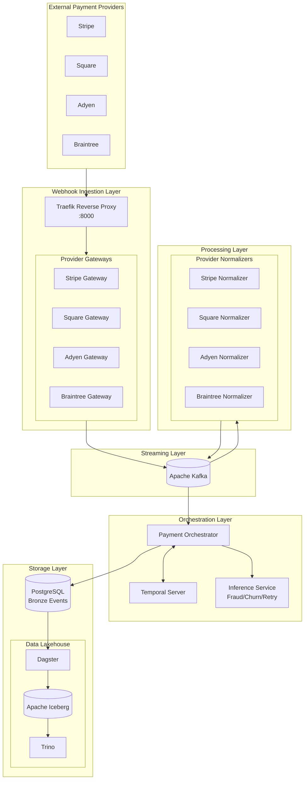

---

## Data Flow

Detailed view of how payment events flow through the system with topic names.

```mermaid
flowchart LR
    subgraph Webhooks["Incoming Webhooks"]
        W1[payment_intent.succeeded]
        W2[charge.captured]
        W3[refund.created]
    end

    subgraph Gateway["Gateway Layer"]
        GW[Payment Gateway<br/>Signature Verification]
        DLQ1[webhooks.dlq]
    end

    subgraph RawTopics["Raw Kafka Topics"]
        T1[webhooks.stripe.payment_intent]
        T2[webhooks.stripe.charge]
        T3[webhooks.stripe.refund]
        T4[webhooks.square.payment]
        T5[webhooks.square.refund]
        T6[webhooks.adyen.notification]
        T7[webhooks.braintree.notification]
    end

    subgraph Normalizer["Normalizer Layer"]
        NM[Schema Normalization<br/>Validation]
        DLQ2[payments.validation.dlq]
    end

    subgraph NormalizedTopic["Normalized Topic"]
        NT[payments.normalized]
    end

    subgraph Orchestrator["Orchestrator Layer"]
        ORC[Temporal Workflows]
    end

    subgraph Enrichment["ML Enrichment"]
        INF[Inference Service]
        FS[Fraud Score]
        CS[Churn Score]
        RS[Retry Strategy]
    end

    subgraph Persistence["Persistence"]
        PG[(PostgreSQL)]
    end

    Webhooks --> GW
    GW -->|valid| RawTopics
    GW -->|invalid signature| DLQ1
    RawTopics --> NM
    NM -->|valid| NT
    NM -->|validation failed| DLQ2
    NT --> ORC
    DLQ2 --> ORC
    ORC --> INF
    INF --> FS
    INF --> CS
    INF --> RS
    ORC --> PG
```

---

## Provider-Specific Containers

Architecture showing independent scaling of provider-specific containers.

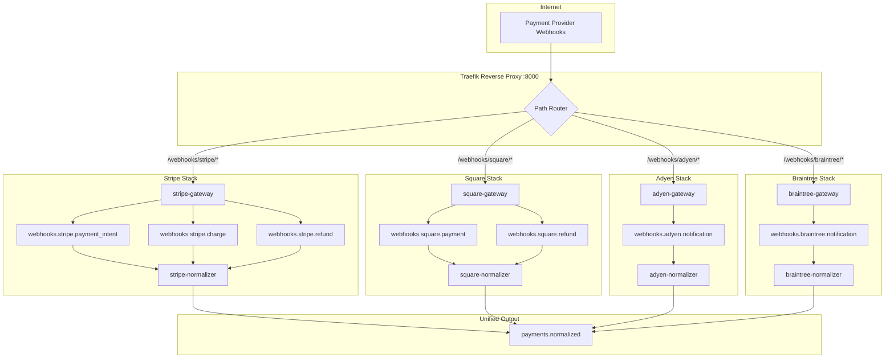

---

## Kafka Topic Flow

Visualization of all Kafka topics and their producers/consumers.

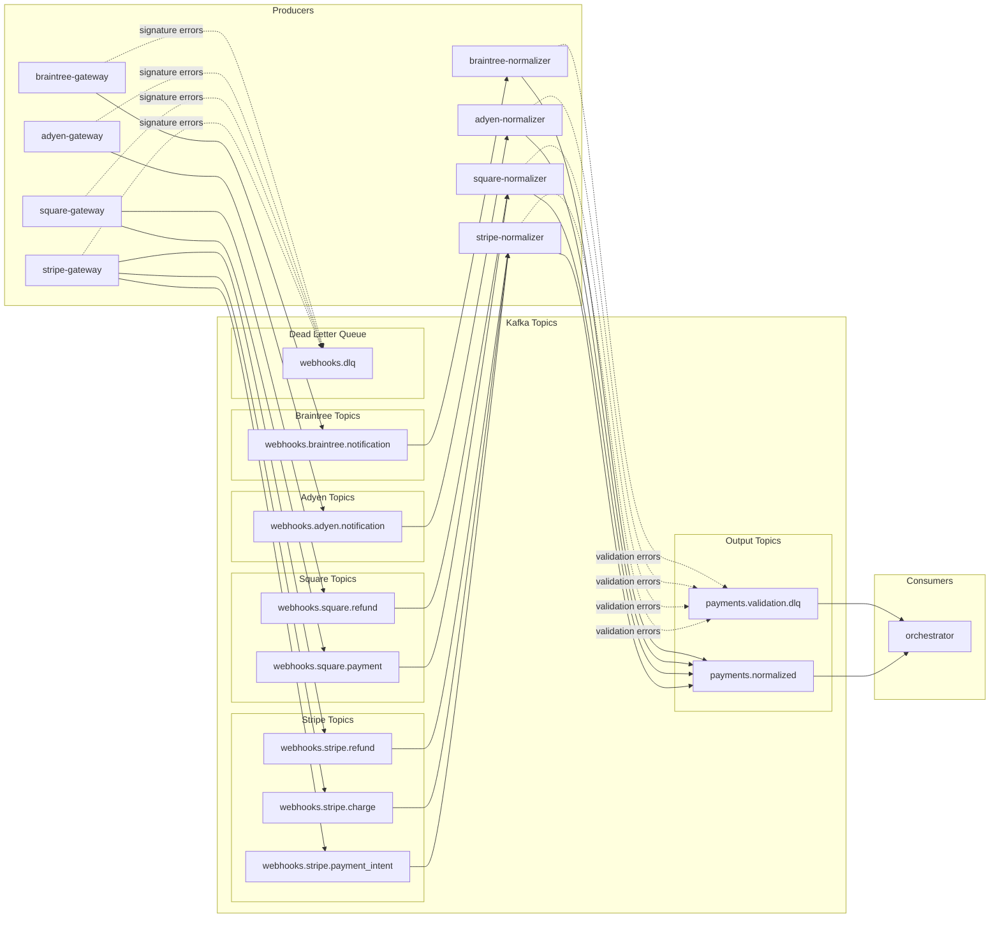

---

## Temporal Orchestration

Workflow execution in Temporal for payment processing.

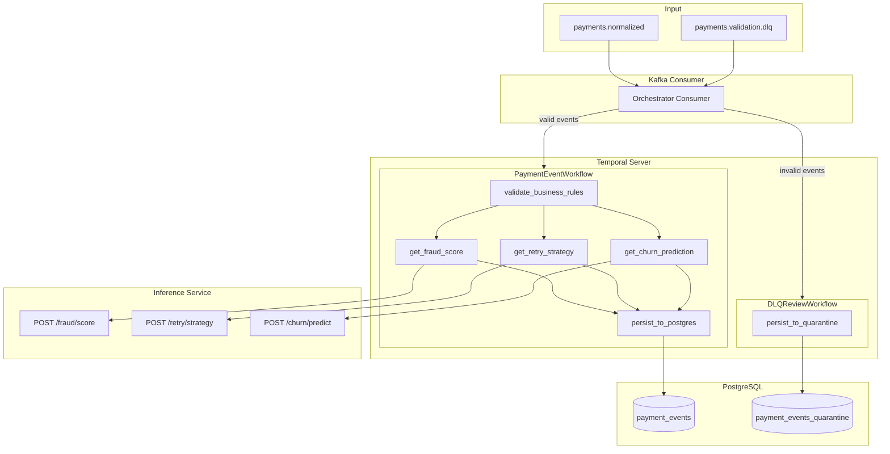

---

## Temporal Activity Flow

Detailed view of activity execution based on payment status.

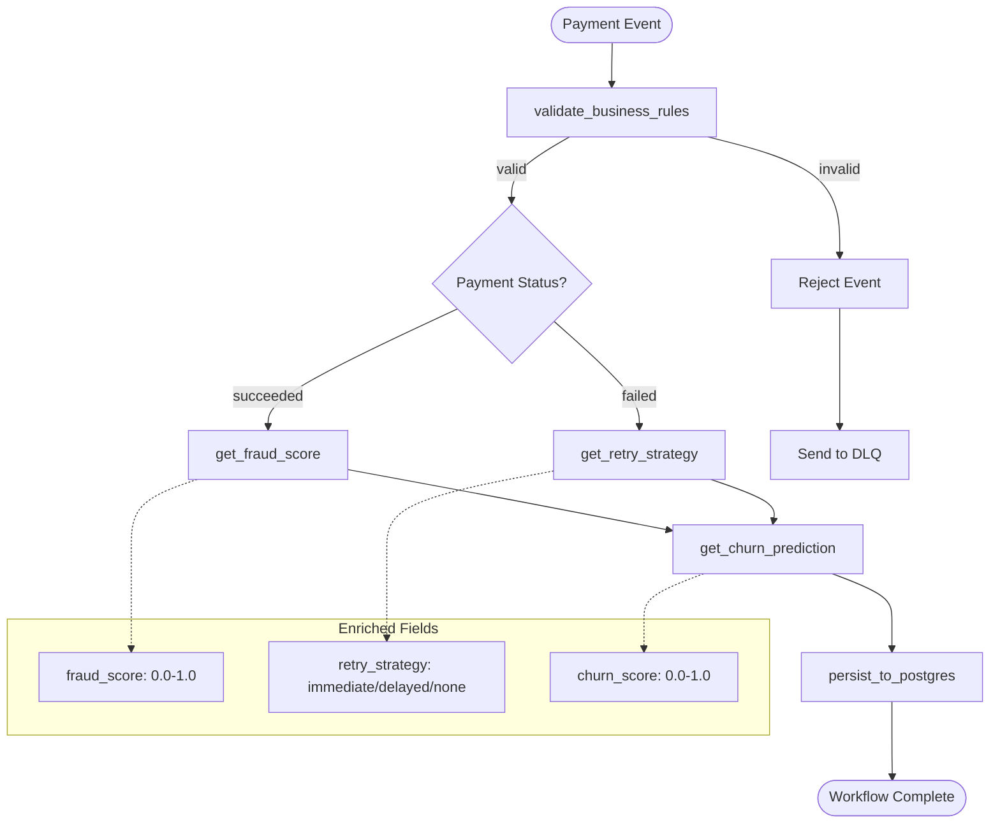

---

## Docker Compose Services

Overview of all Docker Compose services and their profiles.

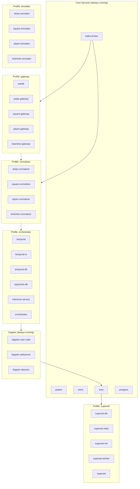

---

## Network Architecture

Docker network connectivity between services.

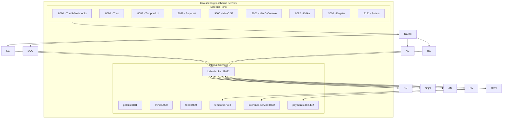

---

## Unified Event Schema

The normalized payment event structure used across all providers.

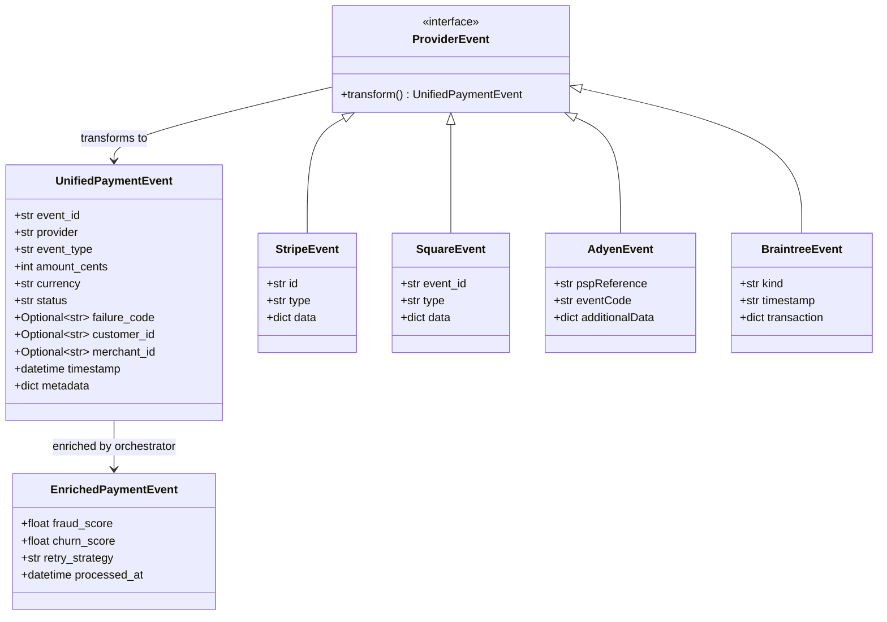

---

## Deployment Profiles

Quick reference for Docker Compose profile combinations.

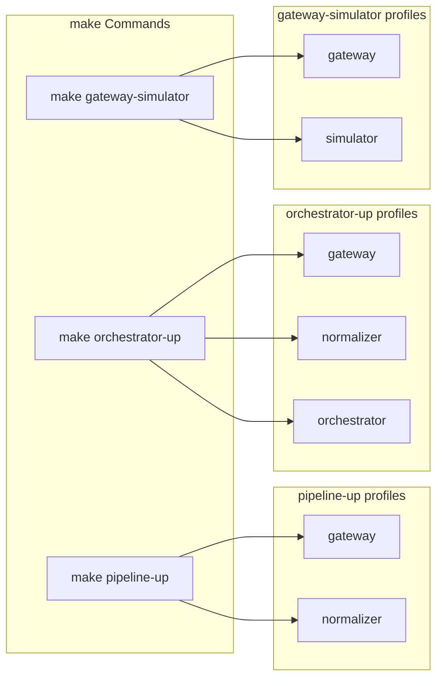

| Command | Profiles | Services Started |
|---------|----------|------------------|
| `make pipeline-up` | gateway, normalizer | Traefik, 4 gateways, 4 normalizers |
| `make orchestrator-up` | gateway, normalizer, orchestrator | Above + Temporal, Inference, Orchestrator |
| `make gateway-simulator` | gateway, simulator | Traefik, 4 gateways, 4 simulators |

---

## Lakehouse Integration

How Polaris, Trino, Dagster, DBT, and MinIO integrate with Apache Iceberg.

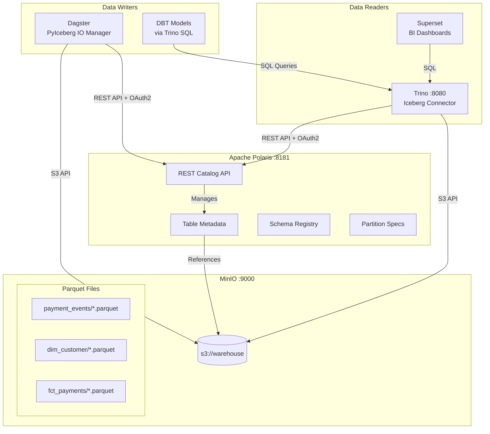

---

## Polaris Catalog Architecture

Apache Polaris as the central Iceberg REST catalog.

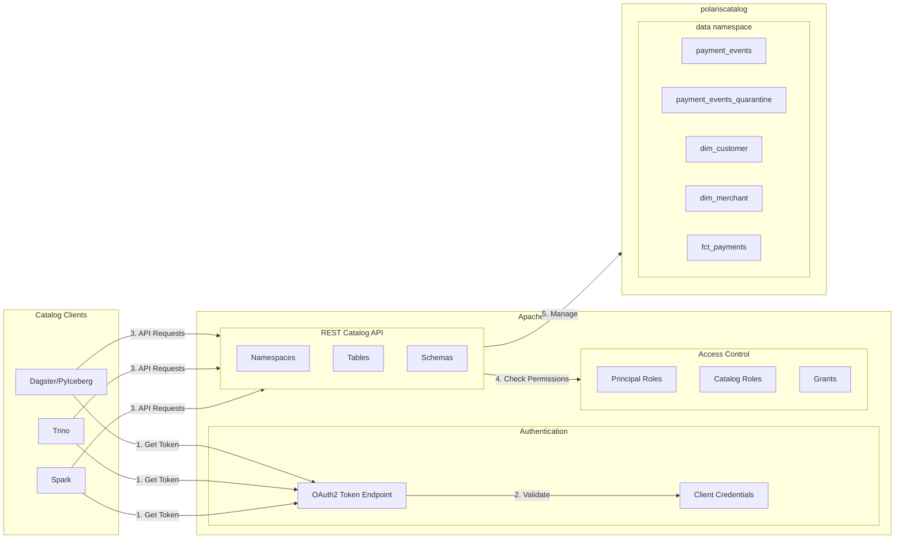

---

## Dagster Iceberg Integration

How Dagster writes DataFrames to Iceberg tables.

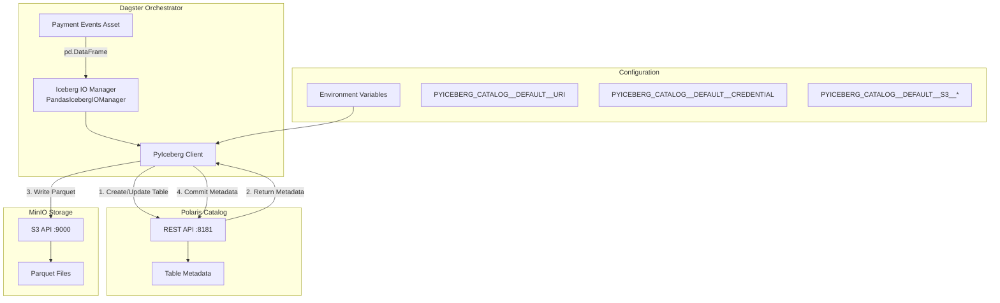

---

## Trino Iceberg Connector

How Trino queries Iceberg tables via Polaris.

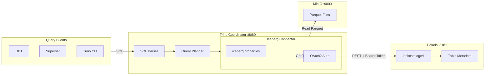

---

## DBT Transformation Flow

How DBT creates Iceberg tables via Trino.

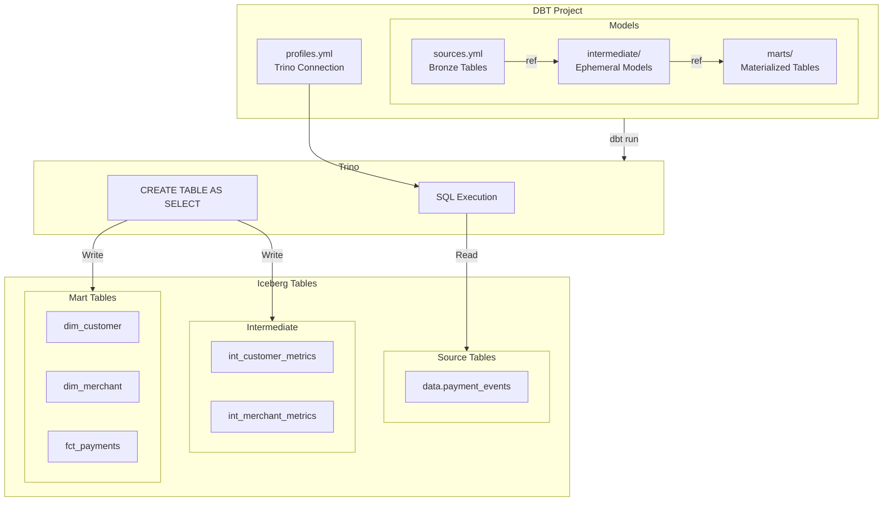

---

## MinIO Storage Layout

How Iceberg data is organized in MinIO object storage.

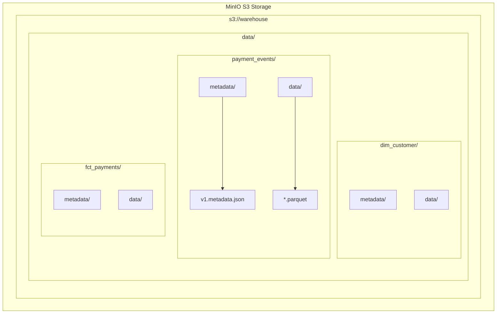

### Storage Structure

| Path | Contents |
|------|----------|
| `s3://warehouse/` | Root bucket |
| `s3://warehouse/data/` | Namespace directory |
| `s3://warehouse/data/{table}/metadata/` | Iceberg metadata JSON files |
| `s3://warehouse/data/{table}/data/` | Parquet data files |

---

## Dagster Asset Lineage

Complete data lineage from PostgreSQL to analytics marts.

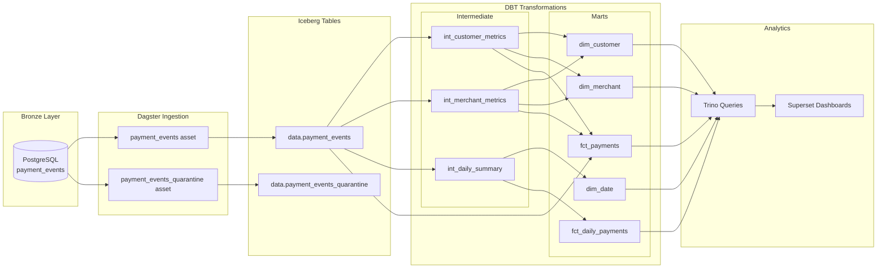

---

## Connection Configuration Summary

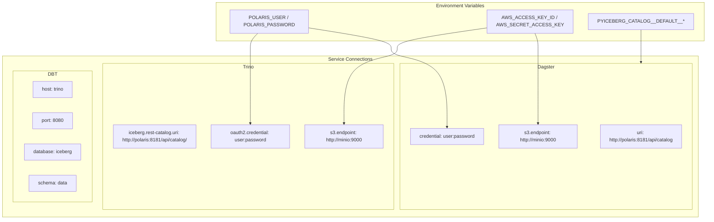

| Service | Polaris URL | MinIO URL | Auth Method |
|---------|-------------|-----------|-------------|
| Dagster | `http://polaris:8181/api/catalog` | `http://minio:9000` | OAuth2 client credentials |
| Trino | `http://polaris:8181/api/catalog/` | `http://minio:9000` | OAuth2 client credentials |
| DBT | N/A (via Trino) | N/A (via Trino) | None (Trino handles) |
